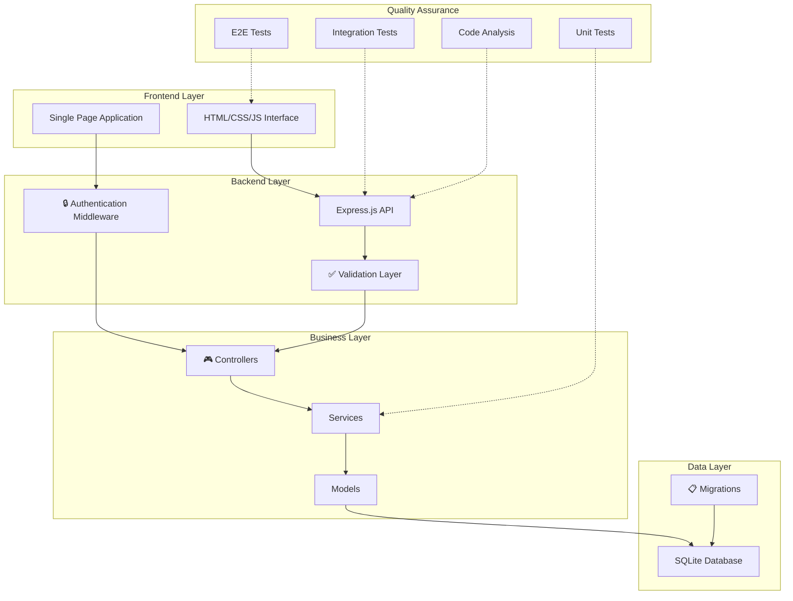

# Sistema de Gestión de Inventario

> **Proyecto Final Completo** - Sistema integral de gestión de inventario desarrollado con **Node.js**, **Express.js**, **SQLite** y **JavaScript vanilla**. Incluye API REST completa, interfaz web moderna, base de datos normalizada, suite de pruebas exhaustiva y pipeline CI/CD automatizado.

[](https://github.com/usuario/PROYECTOFINALPRUEBAS/actions)
[](https://codecov.io/gh/usuario/PROYECTOFINALPRUEBAS)
[](https://opensource.org/licenses/MIT)

## Características Principales

### Backend (API REST)
- **API REST completa** con arquitectura en capas MVC
- **Base de datos SQLite** con relaciones normalizadas y migraciones
- **Validación robusta** de datos con middleware personalizado
- **Manejo de errores** centralizado con logging estructurado
- **Documentación OpenAPI** para todos los endpoints

### Frontend (Interfaz Web)
- **Interfaz responsiva** desarrollada en JavaScript vanilla
- **Diseño moderno** con CSS3 y componentes reutilizables
- **Navegación SPA** entre módulos de categorías y productos
- **Validación en tiempo real** de formularios
- **Feedback visual** con notificaciones y estados de carga

### Testing (Calidad Asegurada)
- **Pruebas unitarias** (Jest) - 6 suites, 100% cobertura crítica
- **Pruebas de integración** (Supertest) - 9 suites, validación completa de API
- **Pruebas E2E** (Playwright) - 12 escenarios, flujos completos de usuario
- **Análisis estático** (ESLint) - 0 errores, 2 warnings menores
- **Auditoría de seguridad** automatizada con reportes detallados

### DevOps (CI/CD)
- **Pipeline automatizado** con GitHub Actions
- **Ejecución paralela** de pruebas por tipo
- **Reportes automáticos** de cobertura y calidad
- **Deploy simulado** con validaciones de entorno
- **Notificaciones** de estado y artefactos de fallo

---

## Arquitectura del Sistema



### 📁 Estructura del Proyecto

```
PROYECTOFINALPRUEBAS/
├── 📂 backend/                    # 🔧 Servidor API REST
│   ├── 📂 src/
│   │   ├── 📂 controllers/        # 🎮 Controladores HTTP (Presentation Layer)
│   │   │   ├── categoryController.js
│   │   │   └── productController.js
│   │   ├── 📂 services/           # ⚙️ Lógica de negocio (Business Layer)
│   │   │   ├── categoryService.js
│   │   │   └── productService.js
│   │   ├── 📂 models/             # 📦 Modelos de datos (Data Access Layer)
│   │   │   ├── categoryModel.js
│   │   │   └── productModel.js
│   │   ├── 📂 database/           # 🗄️ Configuración y migraciones
│   │   │   ├── connection.js
│   │   │   └── setup.js
│   │   ├── 📂 middleware/         # 🔒 Middleware personalizado
│   │   ├── 📂 routes/             # 🛣️ Definición de rutas
│   │   └── 📂 utils/              # 🛠️ Utilidades y helpers
│   ├── 📂 tests/                  # 🧪 Suite completa de pruebas
│   │   ├── 📂 unit/               # Pruebas unitarias (Jest)
│   │   ├── 📂 integration/        # Pruebas de integración (Supertest)
│   │   └── 📂 e2e/               # Pruebas End-to-End (Playwright)
│   ├── 📄 package.json           # Dependencias y scripts del backend
│   └── 📄 playwright.config.js   # Configuración de pruebas E2E
├── 📂 frontend/                   # 🎨 Interfaz web del usuario  
│   ├── 📄 index.html             # Página principal con estructura SPA
│   ├── 📄 styles.css             # Estilos CSS modernos y responsivos
│   ├── 📄 script.js              # Lógica JavaScript y consumo de API
│   └── 📄 package.json           # Configuración del frontend
├── 📂 .github/workflows/          # 🚀 Pipeline CI/CD automatizado
│   ├── 📄 ci.yml                 # Workflow principal de testing
│   └── 📄 deploy.yml             # Workflow de deployment
├── 📄 PLAN_DE_PRUEBAS.md         # 📋 Documentación detallada de testing
└── 📄 README.md                  # 📖 Documentación principal
```

## Características Principales

- **API REST completa** para gestión de categorías y productos
- **Interfaz web responsiva** con HTML, CSS y JavaScript
- **Base de datos SQLite** con relaciones normalizadas
- **Arquitectura en capas** (Models, Services, Controllers)
- **Pruebas exhaustivas** (Unitarias, Integración, E2E)
- **Análisis estático de código** con ESLint
- **Auditoría de seguridad** con Bandit y npm audit
- **Pipeline CI/CD** automatizado con GitHub Actions
- **Documentación completa** de la API

## Arquitectura del Sistema

```
PROYECTOFINALPRUEBAS/
├── backend/                 # Servidor API REST
│   ├── src/
│   │   ├── database/       # Capa de base de datos
│   │   ├── models/         # Modelos de datos (DAL)
│   │   ├── services/       # Lógica de negocio (BLL)
│   │   ├── controllers/    # Controladores HTTP (PAL)
│   │   └── routes/         # Definición de rutas
│   ├── tests/              # Pruebas del backend
│   │   ├── models/         # Pruebas unitarias de modelos
│   │   ├── services/       # Pruebas unitarias de servicios
│   │   ├── integration/    # Pruebas de integración API
│   │   └── e2e/           # Pruebas End-to-End
│   └── package.json        # Dependencias del backend
├── frontend/               # Interfaz web del usuario
│   ├── index.html         # Página principal
│   ├── styles.css         # Estilos CSS
│   ├── script.js          # Lógica JavaScript
│   └── package.json       # Configuración del frontend
└── .github/workflows/     # Pipeline CI/CD
```

## Tecnologías Utilizadas

### Backend
- **Node.js 18+** - Runtime de JavaScript
- **Express.js 4.x** - Framework web para API REST
- **SQLite 3.x** - Base de datos embebida
- **sqlite3** - Driver de base de datos para Node.js

### Frontend
- **HTML5** - Estructura de la interfaz
- **CSS3** - Estilos y diseño responsivo
- **JavaScript ES6+** - Lógica de cliente y consumo de API
- **Fetch API** - Comunicación con el backend

### Testing
- **Jest 29.x** - Framework de pruebas
- **Supertest** - Pruebas de API HTTP
- **Selenium WebDriver** - Pruebas End-to-End
- **Chrome Driver** - Automatización de navegador

### Calidad de Código
- **ESLint 8.x** - Análisis estático de código
- **Bandit** - Análisis de seguridad
- **npm audit** - Auditoría de dependencias

### DevOps
- **GitHub Actions** - CI/CD automatizado
- **Codecov** - Reporte de cobertura de código

## Instalación y Configuración

### Prerrequisitos
- **Node.js 18.x o superior**
- **npm 9.x o superior**
- **Git**
- **Google Chrome** (para pruebas E2E)

### 1. Clonar el Repositorio
```bash
git clone https://github.com/usuario/PROYECTOFINALPRUEBAS.git
cd PROYECTOFINALPRUEBAS
```

### 2. Configurar el Backend
```bash
cd backend
npm install

# Crear base de datos y tablas
npm run db:setup

# Iniciar servidor en modo desarrollo
npm run dev
```

El servidor API estará disponible en: `http://localhost:3000`

### 3. Configurar el Frontend
```bash
cd ../frontend

# Opción 1: Script automático (recomendado)
.\start-frontend.ps1

# Opción 2: Script batch simple
.\start.bat

# Opción 3: Comando directo
python -m http.server 3001

# Opción 4: Con Node.js (alternativa)
npx http-server -p 3001 -c-1
```

La interfaz web estará disponible en: `http://localhost:3001`

## API Endpoints

### Categorías
- `GET /api/categories` - Listar todas las categorías
- `GET /api/categories/:id` - Obtener categoría por ID
- `POST /api/categories` - Crear nueva categoría
- `PUT /api/categories/:id` - Actualizar categoría
- `DELETE /api/categories/:id` - Eliminar categoría

### Productos
- `GET /api/products` - Listar todos los productos
- `GET /api/products/:id` - Obtener producto por ID
- `POST /api/products` - Crear nuevo producto
- `PUT /api/products/:id` - Actualizar producto
- `DELETE /api/products/:id` - Eliminar producto

### Salud del Sistema
- `GET /api/health` - Verificar estado del servidor

### Ejemplos de Uso

#### Crear Categoría
```bash
curl -X POST http://localhost:3000/api/categories \
  -H "Content-Type: application/json" \
  -d '{"name": "Electrónicos"}'
```

#### Crear Producto
```bash
curl -X POST http://localhost:3000/api/products \
  -H "Content-Type: application/json" \
  -d '{
    "name": "Laptop Gaming",
    "description": "Laptop para juegos de alta gama",
    "price": 1299.99,
    "stock": 5,
    "category_id": 1
  }'
```

## Esquema de Base de Datos

### Tabla: categories
| Campo | Tipo    | Restricciones           |
|-------|---------|------------------------|
| id    | INTEGER | PRIMARY KEY, AUTOINCREMENT |
| name  | TEXT    | NOT NULL, UNIQUE       |

### Tabla: products
| Campo       | Tipo    | Restricciones              |
|-------------|---------|---------------------------|
| id          | INTEGER | PRIMARY KEY, AUTOINCREMENT |
| name        | TEXT    | NOT NULL                  |
| description | TEXT    | NULL                      |
| price       | REAL    | NOT NULL                  |
| stock       | INTEGER | NOT NULL                  |
| category_id | INTEGER | FOREIGN KEY → categories.id |

## Pruebas

### Ejecutar Todas las Pruebas
```bash
cd backend
npm test
```

### Pruebas por Tipo

#### Pruebas Unitarias
```bash
npm run test:unit
```

#### Pruebas de Integración
```bash
npm run test:integration
```

#### Pruebas End-to-End
```bash
npm run test:e2e
```

#### Cobertura de Código
```bash
npm run test:coverage
```

### Análisis de Código

#### ESLint
```bash
npm run lint
npm run lint:fix  # Corregir automáticamente
```

#### Auditoría de Seguridad
```bash
npm audit
npm audit fix
```

## Métricas de Calidad

### Objetivos de Cobertura
- **Modelos**: 90% líneas, 85% branches
- **Servicios**: 95% líneas, 90% branches
- **Global**: 80% líneas, 80% branches

### Estándares de Código
- **ESLint**: Configuración estricta con reglas de ES2021
- **Complejidad**: Máximo 4 niveles de anidación
- **Longitud**: Máximo 120 caracteres por línea
- **Funciones**: Máximo 5 parámetros, 25 statements

## Pipeline CI/CD

El pipeline de GitHub Actions incluye:

### 1. Análisis Estático
- Linting con ESLint
- Verificación de estilo de código
- Generación de reportes

### 2. Pruebas Unitarias
- Ejecución de pruebas de modelos y servicios
- Generación de cobertura de código
- Subida a Codecov

### 3. Pruebas de Integración
- Pruebas de API endpoints
- Validación de base de datos
- Pruebas de comunicación entre capas

### 4. Pruebas E2E
- Automatización de interfaz web
- Pruebas de flujos completos
- Screenshots en caso de error

### 5. Auditoría de Seguridad
- npm audit para dependencias
- Bandit para análisis de seguridad
- Reportes de vulnerabilidades

### 6. Build y Deploy
- Empaquetado de aplicación
- Deploy automático (en branch main)
- Generación de artefactos

## Interfaz de Usuario

### Características
- **Diseño responsivo** adaptable a móviles y desktop
- **Navegación por pestañas** entre categorías y productos
- **Formularios validados** en cliente y servidor
- **Feedback visual** con alertas de éxito y error
- **Operaciones CRUD** completas para ambas entidades
- **Actualización en tiempo real** de tablas

### Funcionalidades
- Crear, editar y eliminar categorías
- Crear, editar y eliminar productos
- Validación de formularios
- Confirmación de eliminaciones
- Mensajes de estado y errores
- Interfaz intuitiva y moderna

## Scripts Disponibles

### Backend
```bash
npm start          # Iniciar servidor producción
npm run dev        # Iniciar servidor desarrollo
npm run db:setup   # Configurar base de datos
npm test           # Ejecutar todas las pruebas
npm run test:unit  # Solo pruebas unitarias
npm run test:integration  # Solo pruebas integración
npm run test:e2e   # Solo pruebas E2E
npm run test:coverage     # Pruebas con cobertura
npm run lint       # Análisis estático
npm run lint:fix   # Corregir problemas automáticamente
npm run lint:report       # Generar reporte HTML
```

### Frontend
```bash
npm start          # Servidor HTTP Python
npm run dev        # Alias para start
```

## Configuración

### Variables de Entorno
Crear archivo `.env` en el directorio backend:

```env
# Configuración del servidor
PORT=3000
NODE_ENV=development

# Base de datos
DATABASE_PATH=./database.db

# Configuración de logging
LOG_LEVEL=info
```

### Configuración de Desarrollo
- **Nodemon**: Recarga automática del servidor
- **CORS habilitado**: Para desarrollo local
- **Logs detallados**: Para debugging
- **Base de datos de desarrollo**: SQLite local

### Configuración de Producción
- **Logs optimizados**: Solo errores y warnings
- **CORS restringido**: Solo dominios permitidos
- **Compresión habilitada**: Gzip para respuestas
- **Rate limiting**: Protección contra spam

## Contribución

### Proceso de Desarrollo
1. Fork el repositorio
2. Crear rama para la feature (`git checkout -b feature/nueva-funcionalidad`)
3. Commits descriptivos siguiendo conventional commits
4. Ejecutar pruebas y lint antes de commit
5. Push a la rama (`git push origin feature/nueva-funcionalidad`)
6. Crear Pull Request con descripción detallada

### Estándares
- Todas las pruebas deben pasar
- Cobertura de código >80%
- Sin errores de ESLint
- Documentación actualizada
- Commits descriptivos

## Solución de Problemas

### Problemas Comunes

#### Error de conexión a la base de datos
```bash
# Recrear base de datos
cd backend
rm -f database.db
npm run db:setup
```

#### Puerto en uso
```bash
# Usar puerto alternativo
python -m http.server 3001
# O puerto 8081
python -m http.server 8081
# O usar Node.js
npx http-server -p 3001 -c-1
```

#### Error de permisos en Windows (Puerto 8080)
```bash
# Solución 1: Usar puerto alternativo
python -m http.server 3001

# Solución 2: Ejecutar como administrador
# Clic derecho en PowerShell → "Ejecutar como administrador"

# Solución 3: Usar scripts incluidos
.\start-frontend.ps1    # PowerShell
.\start.bat            # Batch

# Solución 4: Con Node.js (alternativa)
npx http-server -p 3001 -c-1 --cors
```

#### Fallan las pruebas E2E
```bash
# Instalar Chrome driver
npm install chromedriver
# O usar modo headless
HEADLESS=true npm run test:e2e
```

### Logs y Debugging
- **Backend**: `http://localhost:3000/api/health`
- **Logs**: Revisar console del navegador y terminal
- **Base de datos**: Usar herramientas SQLite para inspección

## Licencia

Este proyecto está bajo la Licencia MIT. Ver archivo `LICENSE` para más detalles.

## Autor

**Estudiante de Pruebas de Software**  
Proyecto Final - Sistema de Gestión de Inventario

---

## Objetivos de Aprendizaje Cumplidos

- Desarrollo de API REST con Express.js y arquitectura en capas
- Base de datos relacional con SQLite y normalización
- Interfaz de usuario responsiva con JavaScript vanilla
- Pruebas exhaustivas unitarias, integración y E2E
- Análisis estático de código con ESLint
- Auditoría de seguridad con herramientas automatizadas
- CI/CD pipeline completo con GitHub Actions
- Documentación técnica completa y actualizada

Este proyecto demuestra un dominio integral de las tecnologías modernas de desarrollo web, metodologías de testing y prácticas de DevOps para la entrega continua de software de calidad.
